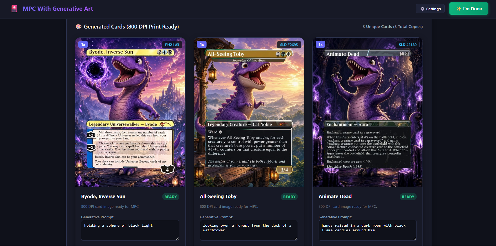

# MPCWithGenerativeArt

[](https://github.com/ROMzombie/MPCWithGenerativeArt/actions/workflows/ci.yml)
[](https://github.com/ROMzombie/MPCWithGenerativeArt/releases)
[](https://github.com/ROMzombie/MPCWithGenerativeArt/pkgs/container/mpcwithgenerativeart)

MPCWithGenerativeArt creates full-art card decks for [MakePlayingCards](https://www.makeplayingcards.com/). The application combines AI image generation, Scryfall card frames, and 800 DPI print compositing.



---

## Features

- **Deck List Parser**: Reads standard deck lists with card prompts and `# global style prompt` prefixes.
- **Multi-Provider AI Image Generation**: Connects to xAI Grok, Google Gemini Imagen, OpenAI DALL-E, DeepSeek Janus-Pro, Perchance AI, and local procedural generation.
- **Card Frame and Bleed Compositing**: Extracts high-resolution card frames, masks art windows, preserves text boxes, and applies standard MakePlayingCards 800 DPI poker bleed margins (2184x2968 px).
- **Interactive Web Interface**: Provides real-time preview grids, progress streaming via Server-Sent Events, and per-card prompt editing.
- **MakePlayingCards Integration**: Exports `cards.xml`, downloads complete ZIP packages, or runs a browser script to fill orders on the MakePlayingCards website.

---

## Quickstart with Docker

### Option 1: Docker Compose (Recommended)

1. Clone this repository or copy [`docker-compose.yml`](docker-compose.yml) and [`.env.example`](.env.example).
2. Create and configure your `.env` file:

```bash
cp .env.example .env
```

Edit `.env` to set your desired `GENERATOR_PROVIDER` and API keys:

```ini
GENERATOR_PROVIDER=grok
XAI_API_KEY=your_xai_api_key_here
```

3. Start the container:

```bash
docker compose up -d
```

Docker Compose automatically loads values from the `.env` file into the container environment.

4. Open `http://localhost:8000` in your web browser.

### Option 2: Docker CLI

1. Create your `.env` configuration file:

```bash
cp .env.example .env
```

2. Run the container with the `--env-file` flag:

```bash
docker run -d \
  --name mpc-generative-art \
  -p 8000:8000 \
  -v mpc_output:/app/output \
  -v mpc_cache:/app/cache \
  --env-file .env \
  ghcr.io/romzombie/mpcwithgenerativeart:latest
```

Alternatively, pass individual environment flags:

```bash
docker run -d \
  --name mpc-generative-art \
  -p 8000:8000 \
  -v mpc_output:/app/output \
  -v mpc_cache:/app/cache \
  -e GENERATOR_PROVIDER=grok \
  -e XAI_API_KEY=your_xai_key_here \
  ghcr.io/romzombie/mpcwithgenerativeart:latest
```

3. Open `http://localhost:8000` in your web browser.

---

## Quickstart with Local Python

### Prerequisites

- Python 3.10 or higher
- Playwright Chromium (optional, needed for the free Perchance AI generator)

### Setup Steps

1. Clone the repository:

```bash
git clone https://github.com/ROMzombie/MPCWithGenerativeArt.git
cd MPCWithGenerativeArt
```

2. Install Python dependencies:

```bash
pip install -r requirements.txt
```

3. Install Playwright Chromium:

```bash
playwright install chromium
```

4. Create your `.env` configuration file:

```bash
cp .env.example .env
```

5. Start the application:

```bash
uvicorn backend.app:app --reload --port 8000
```

6. Open `http://localhost:8000` in your web browser.

---

## Deck File Input Format

The application accepts deck lists with `#`-separated prompts.

### Format Definition

```text
# [Optional global style prompt applied to all cards]
Copies CardName (set) CollectorNumber # prompt
```

### Example Input

```text
# in watercolor studio ghibli fantasy anime style
1 Byode, Inverse Sun (PH21) 3 # An anime girl dressed like a pixie
1 All-Seeing Toby (SLD) 2695 # An anime boy in a library holding a book
2 Animate Dead (SLD) 2189 # An old man in an anime style holding his hand up with a magic sphere
```

- **Copies**: The quantity of cards to print.
- **CardName**: The card title matching Scryfall.
- **(set)**: The 3-character or 4-character MTG set code in parentheses.
- **CollectorNumber**: The card collector number.
- **prompt**: The prompt for the background image. Separate this prompt from the collector number with ` # `.
- **Global Prompt (`# ...`)**: An optional style prefix at the top of the file. The generator prepends this text to every card prompt.

---

## Generative AI Providers

Set the `GENERATOR_PROVIDER` setting to choose your active image generator.

| Provider Value | Description | Authentication |
| :--- | :--- | :--- |
| `perchance` / `perchance-ai` | Headless browser generator via Playwright. Free. | None needed. |
| `grok` / `xai` | xAI Grok Imagine 2.0 image model. | Set `XAI_API_KEY`. |
| `janus` / `janus-pro` | DeepSeek Janus-Pro-7B via Hugging Face Spaces. | Optional `HF_TOKEN`. |
| `gemini` / `imagen` | Google Gemini Imagen 3.0 model. | Set `GEMINI_API_KEY`. |
| `openai` / `dall-e` | OpenAI DALL-E 3 image model. | Set `OPENAI_API_KEY`. |
| `mock` / `procedural` | Local algorithmic pattern generator. Instant and offline. | None needed. |

---

## Environment Variables

Configure these settings through environment variables or inside your `.env` file.

| Variable | Default | Description |
| :--- | :--- | :--- |
| `GENERATOR_PROVIDER` | `perchance` | Active image backend (`perchance`, `grok`, `janus`, `gemini`, `openai`, `mock`). |
| `XAI_API_KEY` | *(empty)* | xAI API key for Grok image generation. |
| `GEMINI_API_KEY` | *(empty)* | Google AI Studio API key for Imagen 3. |
| `OPENAI_API_KEY` | *(empty)* | OpenAI API key for DALL-E 3. |
| `HF_TOKEN` | *(empty)* | Hugging Face user access token for Janus-Pro ZeroGPU priority. |
| `GENERATOR_TIMEOUT` | `300.0` | Total HTTP client timeout in seconds for AI generators. |
| `GENERATOR_READ_TIMEOUT` | `300.0` | Socket read timeout in seconds waiting for generator responses. |
| `GENERATOR_CONNECT_TIMEOUT` | `60.0` | Socket connection timeout in seconds. |
| `GENERATOR_WRITE_TIMEOUT` | `60.0` | Socket write timeout in seconds. |
| `ENV_FILE` | `.env` | File path for persisting runtime UI settings. Set to `none` to disable disk writes. |
| `TESTING` | `false` | When set to `true`, protects `.env` from test updates. |

---

## Print Compositing and Bleed Margins

MakePlayingCards poker cards require standard bleed margins.

- **Target Output Dimensions**: 2184 x 2968 pixels at 800 DPI (69.3 mm x 94.2 mm).
- **Bleed Scaling Factor**: `0.90` (5% outer border margin).
- **Text Box Exclusion**: The compositor detects title bars, type lines, rules boxes, power and toughness badges, and loyalty badges. The compositor preserves these elements over the generated background art.
- **Edge Feathering**: The compositor softens text box cutouts to blend borders with generative art.

---

## MakePlayingCards Upload and Export

When card generation completes, export your order using three options:

1. **Browser Injector Script**:
   - Open MakePlayingCards in your web browser.
   - Start an order for custom poker-sized cards.
   - Copy the injector script from `/api/mpc/injector.js` or click the button in the web interface.
   - Open your browser Developer Tools console on the MakePlayingCards site and paste the script. The script uploads every card and fills the card slots.
2. **Download `cards.xml`**:
   - Download the XML file formatted for the MakePlayingCards autofill desktop tool.
3. **Download ZIP Package**:
   - Export an archive containing `cards.xml` and all 800 DPI card images.

---

## Running Tests

Run the test suite with the Python `unittest` runner:

```bash
python -m unittest tests/test_grok.py tests/test_janus.py tests/test_api.py tests/test_pipeline.py
```