# MTG Card Layout Variants & Sample Gallery

This document showcases full-art generative card compositing across all supported **standard Magic: The Gathering card layouts and frame variants**.

> [!NOTE]
> These samples cover all structural card frame variants (standard creatures, legendary crowns, planeswalkers, battles, vehicles, and multi-tier station cards).
> They do not include non-standard full-art or Secret Lair promotional treatments that alter text box geometries.

## Table of Contents

- [Standard Creature — Llanowar Elves](#standard-creature)
- [Legendary Creature — Ekthi, Contaminator Priest](#legendary-creature)
- [Artifact / Equipment — Adaptive Omnitool](#artifact--equipment)
- [Artifact Creature — Solemn Simulacrum](#artifact-creature)
- [Enchantment (Global) — Smothering Tithe](#enchantment-global)
- [Enchantment (Aura) — Rancor](#enchantment-aura)
- [Enchantment (Saga) — Elspeth Conquers Death](#enchantment-saga)
- [Enchantment (Class) — Paladin Class](#enchantment-class)
- [Enchantment (Case) — Case of the Crimson Pulse](#enchantment-case)
- [Enchantment (Room) — Dollmaker's Shop // Porcelain Gallery](#enchantment-room)
- [Instant — Counterspell](#instant)
- [Sorcery — Wrath of God](#sorcery)
- [Battle (Siege) — Invasion of Gobakhan](#battle-siege)
- [Land (Non-Basic) — Command Tower](#land-non-basic)
- [Land (Basic) — Island](#land-basic)
- [Planeswalker — Byode, Inverse Sun](#planeswalker)
- [Vehicle / Spacecraft — Smuggler's Copter](#vehicle--spacecraft)
- [Station Card (1 Circle Badge) — Adagia, Windswept Bastion](#station-card-1-circle-badge)
- [Station Card (2 Circle Badges) — Dawnsire, Sunstar Dreadnought](#station-card-2-circle-badges)
- [Station Card (3 Circle Badges) — Entropic Battlecruiser](#station-card-3-circle-badges)
- [Adventure (Creature / Spell) — Giant Killer // Chop Down](#adventure-creature--spell)

---

## Sample Card Gallery

### Standard Creature

**Card:** `Llanowar Elves` (`FDN` #227)  
**Description:** Standard non-legendary creature frame with Power/Toughness badge in bottom-right corner.  
**Sample Prompt:** *"Vibrant ancient elven druid channeled with glowing emerald forest magic in sunlit grove"*

<p align="center">
  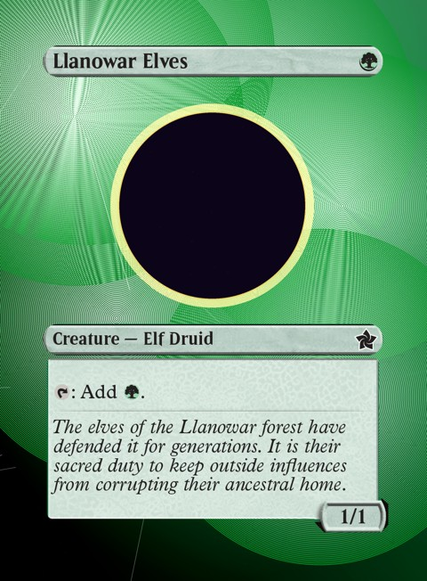
</p>

**Key Frame Elements Preserved:**
- Standard rounded title pill
- Type line box
- Text box with rules & flavor text
- Bottom-right Power/Toughness stat box (1/1)

---

### Legendary Creature

**Card:** `Ekthi, Contaminator Priest` (`MBC` #1)  
**Description:** Legendary creature frame with rounded title pill, Power/Toughness box, and rare holographic security stamp.  
**Sample Prompt:** *"Phyrexian mechanical horror priest with bio-mechanical armor and porcelain skin"*

<p align="center">
  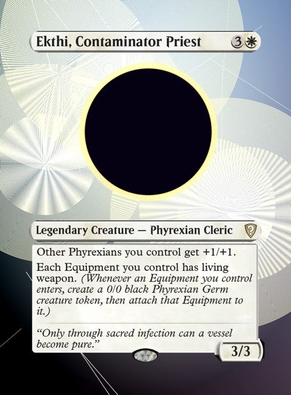
</p>

**Key Frame Elements Preserved:**
- Rounded title pill with mana cost
- Type line box
- Rules box with full flavor text
- Bottom-center holographic security stamp oval
- Bottom-right Power/Toughness stat box (3/3)

---

### Artifact / Equipment

**Card:** `Adaptive Omnitool` (`DRC` #16)  
**Description:** Standard artifact frame without Power/Toughness box, featuring full ability rules text, equip cost, and bottom frame crest.  
**Sample Prompt:** *"Ancient intricate glowing artifact device with neon circuits and chrome plating"*

<p align="center">
  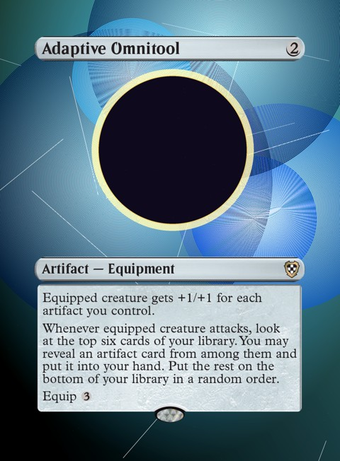
</p>

**Key Frame Elements Preserved:**
- Metallic artifact title pill
- Type line box
- Complete text box with 'Equip 3' cost line
- Bottom center frame crest

---

### Artifact Creature

**Card:** `Solemn Simulacrum` (`CMM` #393)  
**Description:** Artifact creature frame combining metallic border treatment with bottom-right Power/Toughness box and rare holographic stamp.  
**Sample Prompt:** *"Melancholy ornate clockwork brass automaton walking through misty ancient ruins"*

<p align="center">
  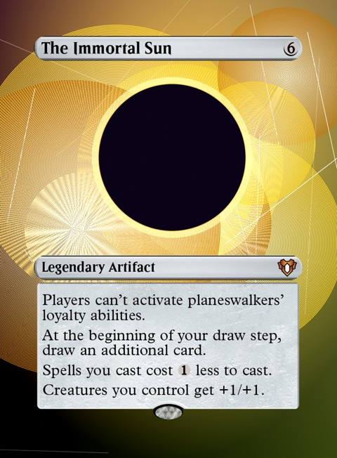
</p>

**Key Frame Elements Preserved:**
- Artifact title pill
- Artifact Creature type line
- Rules text box with triggered abilities
- Bottom-center holographic security stamp oval
- Bottom-right Power/Toughness stat box (2/2)

---

### Enchantment (Global)

**Card:** `Smothering Tithe` (`RNA` #22)  
**Description:** Non-creature enchantment card layout with full rules box and rare holofoil stamp.  
**Sample Prompt:** *"Grand gilded cathedral vault with floating golden coins and ornate celestial stained glass"*

<p align="center">
  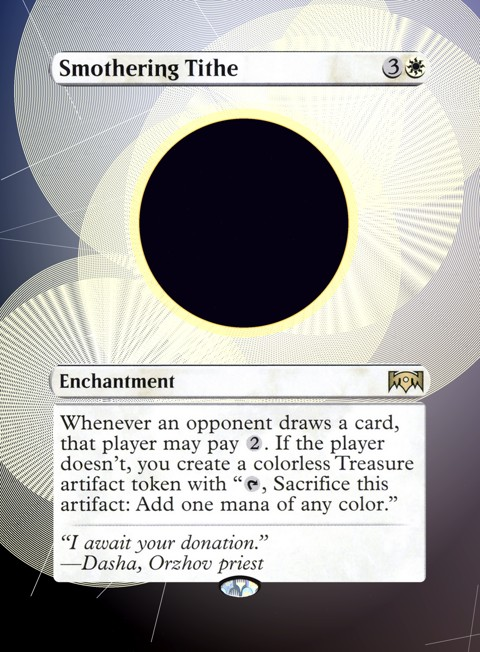
</p>

**Key Frame Elements Preserved:**
- White enchantment title pill
- Enchantment type line
- Rules text box with triggered ability
- Bottom center holographic security stamp oval

---

### Enchantment (Aura)

**Card:** `Rancor` (`2X2` #156)  
**Description:** Aura enchantment frame with target enchantment type line and recursive aura return rules text.  
**Sample Prompt:** *"Feral glowing primal beast spirit roaring with fierce green ethereal energy"*

<p align="center">
  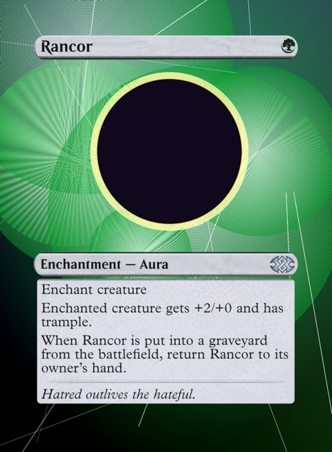
</p>

**Key Frame Elements Preserved:**
- Green enchantment title pill
- Enchantment — Aura type line
- Rules text box with static and death trigger abilities
- Bottom center frame crest

---

### Enchantment (Saga)

**Card:** `Elspeth Conquers Death` (`THB` #13)  
**Description:** Saga enchantment frame with left-side vertical chapter ability column, right-side art column, bottom type line, and holofoil stamp.  
**Sample Prompt:** *"Ornate mythological mosaic artwork depicting victorious celestial knight banishing shadows"*

<p align="center">
  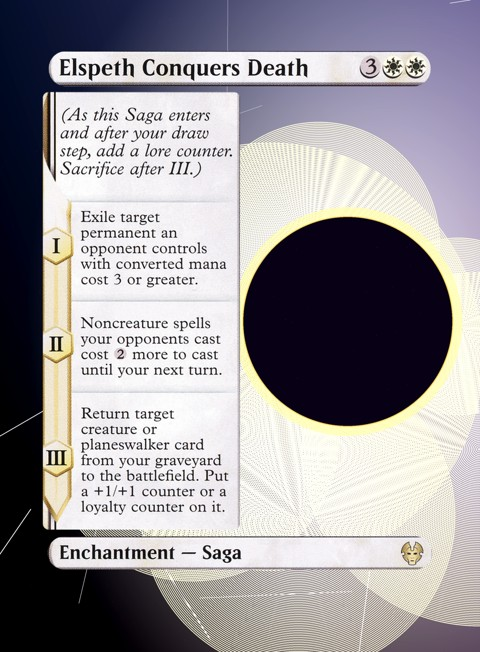
</p>

**Key Frame Elements Preserved:**
- Top title pill with 3WW mana cost
- Left vertical chapter column with Roman numeral badges (I, II, III)
- Bottom type line pill (Enchantment — Saga)
- Bottom holographic security stamp oval

---

### Enchantment (Class)

**Card:** `Paladin Class` (`AFR` #29)  
**Description:** Class enchantment frame with left-side vertical art column, right-side multi-tier level ability boxes, and bottom type line.  
**Sample Prompt:** *"Heroic holy warrior shining plate armor helmet bathed in divine dawn sunlight"*

<p align="center">
  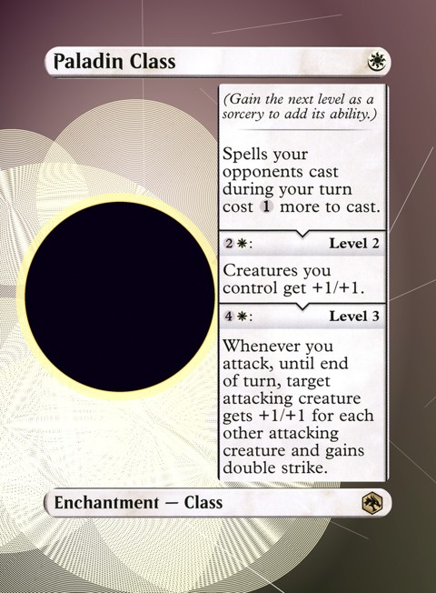
</p>

**Key Frame Elements Preserved:**
- Top title pill with W mana cost
- Right vertical level advancement rules boxes (Level 2, Level 3)
- Bottom type line pill (Enchantment — Class)
- Bottom holographic security stamp oval

---

### Enchantment (Case)

**Card:** `Case of the Crimson Pulse` (`MKM` #114)  
**Description:** Case enchantment frame with left-side art window, right-side progression rules box ('To solve', 'Solved'), and bottom type line.  
**Sample Prompt:** *"Mysterious detective investigation map in victorian steampunk manor glowing with neon lines"*

<p align="center">
  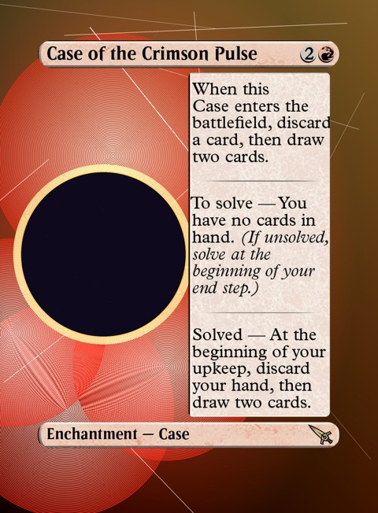
</p>

**Key Frame Elements Preserved:**
- Top title pill with 2R mana cost
- Right vertical Case progression rules box (Initial, To solve, Solved)
- Bottom type line pill (Enchantment — Case)
- Bottom holographic security stamp oval

---

### Enchantment (Room)

**Card:** `Dollmaker's Shop // Porcelain Gallery` (`DSK` #4)  
**Description:** Room enchantment frame with dual split door layouts (left and right doors), center door-unlock banner, and holofoil stamp.  
**Sample Prompt:** *"Eerie haunted chamber lined with cracked antique porcelain dolls and moonlit shadows"*

<p align="center">
  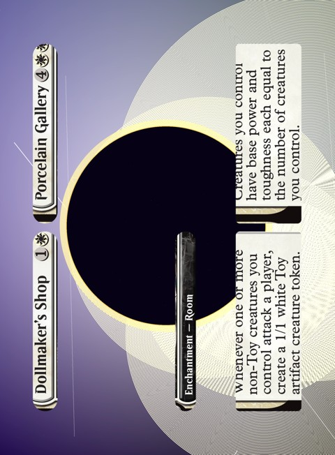
</p>

**Key Frame Elements Preserved:**
- Dual title pills (Dollmaker's Shop 1W and Porcelain Gallery 4WW)
- Center door unlocking banner (Enchantment — Room)
- Dual independent door rules text boxes
- Bottom holographic security stamp oval

---

### Instant

**Card:** `Counterspell` (`MH2` #267)  
**Description:** Standard instant spell layout featuring clean text box with rules and flavor text.  
**Sample Prompt:** *"Mystic glowing sapphire spell runes dispersing swirling temporal energy rift in cosmos"*

<p align="center">
  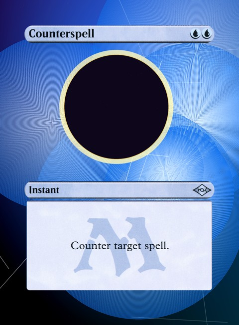
</p>

**Key Frame Elements Preserved:**
- Instant title pill with UU mana cost
- Instant type line
- Rules text box with centered flavor text
- Bottom center frame crest

---

### Sorcery

**Card:** `Wrath of God` (`CMM` #70)  
**Description:** Standard sorcery spell layout with full rules box, flavor text, and rare holofoil stamp.  
**Sample Prompt:** *"Cataclysmic pillar of blinding divine light descending from heavenly clouds annihilating battlefield"*

<p align="center">
  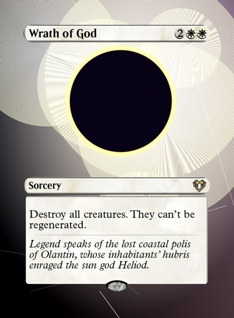
</p>

**Key Frame Elements Preserved:**
- Sorcery title pill with 2WW mana cost
- Sorcery type line
- Rules text box with board wipe effect and flavor text
- Bottom center holographic security stamp oval

---

### Battle (Siege)

**Card:** `Invasion of Gobakhan` (`MOM` #22)  
**Description:** Battle siege layout featuring horizontal frame structure, left-side title column, rules box, type line, and defense counter badge.  
**Sample Prompt:** *"Epic sci-fi planetary invasion with celestial shield barrier deflecting particle orbital bombardments"*

<p align="center">
  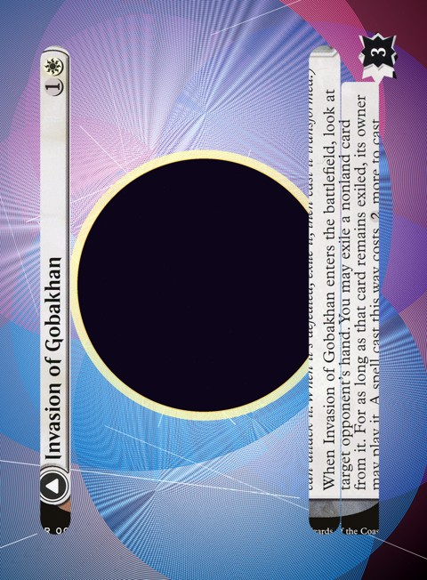
</p>

**Key Frame Elements Preserved:**
- Left vertical title column with 1W mana cost
- Battle — Siege type line box
- Rules text box with trigger effects
- Top-right polygonal Defense counter badge (3)
- Bottom holographic security stamp oval

---

### Land (Non-Basic)

**Card:** `Command Tower` (`CMM` #420)  
**Description:** Standard non-basic land frame without mana cost, with full rules box and rare holofoil stamp.  
**Sample Prompt:** *"Monolithic towering obsidian citadel glowing with prismatic planar beacons over mystical landscape"*

<p align="center">
  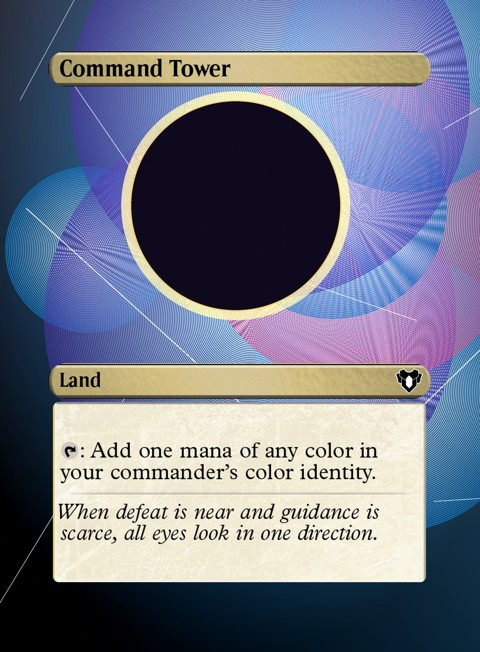
</p>

**Key Frame Elements Preserved:**
- Land title pill without mana cost
- Land type line
- Rules text box with mana ability
- Bottom center holographic security stamp oval

---

### Land (Basic)

**Card:** `Island` (`FDN` #276)  
**Description:** Standard basic land layout featuring centered large mana symbol watermark in text box.  
**Sample Prompt:** *"Serene tropical azure island with crystalline lagoons and lush glowing palm groves"*

<p align="center">
  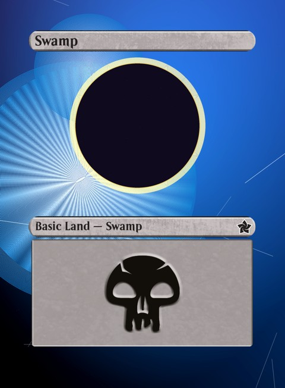
</p>

**Key Frame Elements Preserved:**
- Basic Land title pill
- Basic Land — Island type line
- Text box with basic mana tap ability
- Bottom center frame crest

---

### Planeswalker

**Card:** `Byode, Inverse Sun` (`PH21` #3)  
**Description:** Planeswalker layout featuring multi-loyalty ability text box with irregular polygonal loyalty shield at bottom-right.  
**Sample Prompt:** *"Celestial radiant universewalker deity floating among cosmic star clusters and solar nebulae"*

<p align="center">
  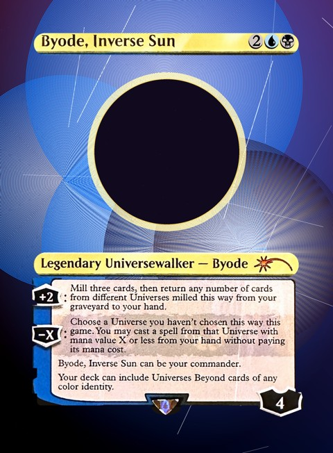
</p>

**Key Frame Elements Preserved:**
- Planeswalker title pill
- Legendary Planeswalker type line
- Loyalty ability rules box
- 8-point polygonal starting loyalty shield (3)

---

### Vehicle / Spacecraft

**Card:** `Smuggler's Copter` (`KLD` #235)  
**Description:** Vehicle artifact frame with crew ability rules text and Power/Toughness box.  
**Sample Prompt:** *"Sleek brass aetherpunk rotorcraft soaring over sunlit spires and cloudscapes"*

<p align="center">
  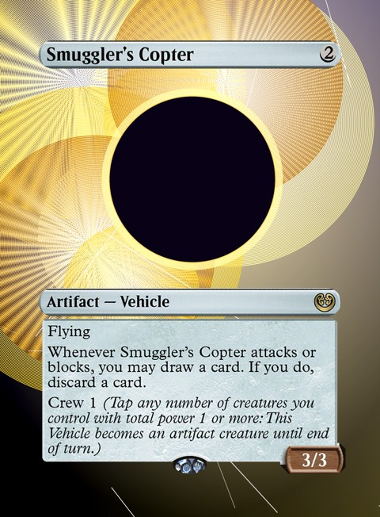
</p>

**Key Frame Elements Preserved:**
- Artifact vehicle title pill
- Artifact — Vehicle type line
- Rules text box with Crew ability
- Bottom-right Power/Toughness box (3/3)

---

### Station Card (1 Circle Badge)

**Card:** `Adagia, Windswept Bastion` (`EOE` #250)  
**Description:** Station card featuring a single circular Station activation badge protruding from the left rules box border.  
**Sample Prompt:** *"Massive ancient orbital planetary fortress with glowing ring reactors above stormy clouds"*

<p align="center">
  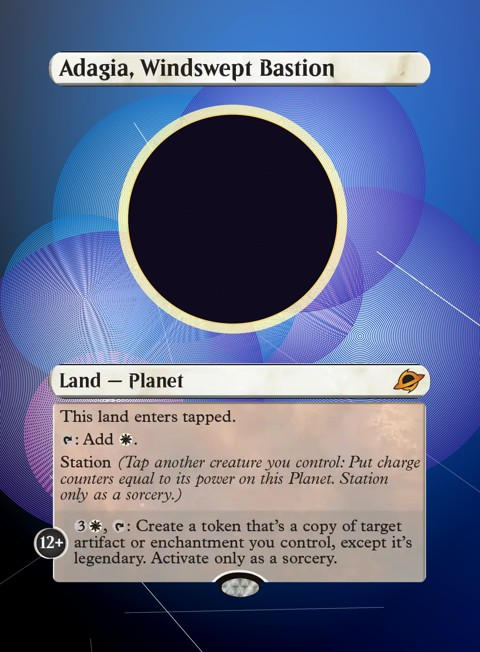
</p>

**Key Frame Elements Preserved:**
- Land title pill
- Land — Planet type line
- Targeted circular Station badge (12+) on left margin
- Rules text box with station mechanics
- Bottom holographic security stamp oval

---

### Station Card (2 Circle Badges)

**Card:** `Dawnsire, Sunstar Dreadnought` (`EOE` #238)  
**Description:** Legendary Spacecraft Station card featuring two edge-protruding Station badges (10+ and 20+) and Power/Toughness box.  
**Sample Prompt:** *"Colossal golden starship dreadnought flying through supernova plasma flare"*

<p align="center">
  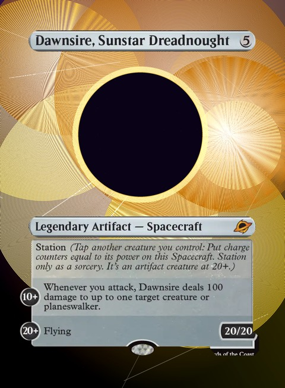
</p>

**Key Frame Elements Preserved:**
- Rounded title pill with mana cost
- Legendary Artifact — Spacecraft type line
- Dual targeted circular Station badges (10+ and 20+) on left margin
- Rules text box with Station levels
- Bottom-right Power/Toughness box (20/20)
- Bottom holographic security stamp oval

---

### Station Card (3 Circle Badges)

**Card:** `Entropic Battlecruiser` (`EOE` #99)  
**Description:** Spacecraft Station card featuring three edge-protruding Station badges (8+, 14+, and 20+) and Power/Toughness box.  
**Sample Prompt:** *"Ominous dark matter battlecruiser charging catastrophic vortex beams across nebulas"*

<p align="center">
  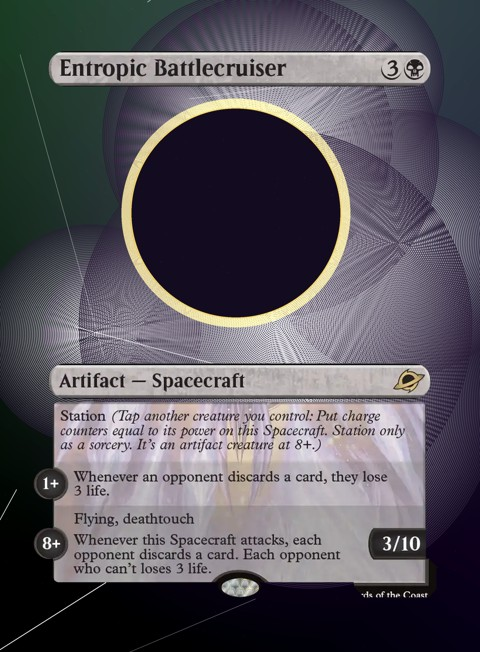
</p>

**Key Frame Elements Preserved:**
- Artifact vehicle title pill
- Artifact — Spacecraft type line
- Triple targeted circular Station badges (8+, 14+, and 20+) on left margin
- Rules text box with 3 station ability tiers
- Bottom-right Power/Toughness box (10/10)
- Bottom holographic security stamp oval

---

### Adventure (Creature / Spell)

**Card:** `Giant Killer // Chop Down` (`ELD` #14)  
**Description:** Adventure frame with split left-side Adventure spell tome and right-side creature text box, plus Power/Toughness badge.  
**Sample Prompt:** *"Valiant miniature armored knight drawing glowing enchanted sword facing colossal giant shadow"*

<p align="center">
  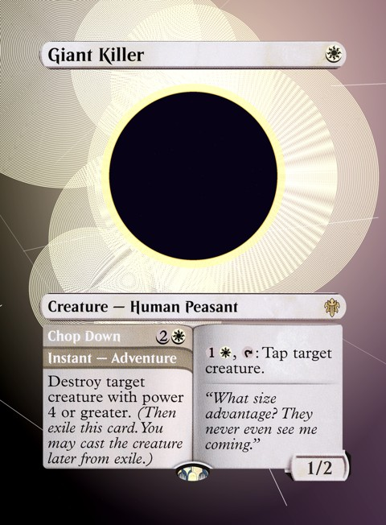
</p>

**Key Frame Elements Preserved:**
- Creature title pill
- Creature type line
- Left Adventure spell scroll (Chop Down 2W Instant)
- Right creature rules text box
- Bottom-right Power/Toughness box (1/2)

---

## Regenerating Samples

To regenerate all sample card outputs and update the documentation gallery, execute:

```bash
python backend/generate_samples.py
```

To verify all sample variants via automated unit testing:

```bash
python -m unittest tests/test_samples.py
```
